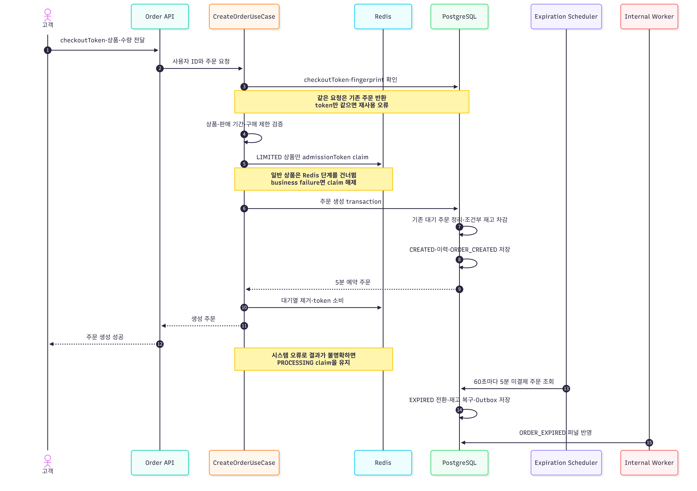
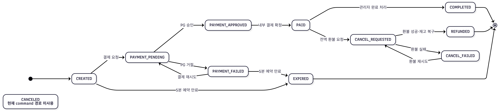

# 주문 정책

## 주문 처리 흐름

정상 주문 생성 흐름을 중심으로 표시하고 멱등성·실패·만료 정책은 Note로 정리합니다.

일반 상품은 token claim 단계를 건너뜁니다. 시스템 오류로 결과가 불명확하면 claim을
즉시 해제하지 않고, 같은 `checkoutToken` 재요청으로 DB 결과를 먼저 확인합니다.

## 생성 조건

- JWT 사용자만 자신의 주문을 생성·조회할 수 있습니다.
- `checkoutToken`은 필수이며 최대 255자입니다.
- 주문 항목은 1~50개이고 상품 ID와 수량은 양수여야 합니다.
- 같은 상품을 여러 항목으로 중복 요청할 수 없습니다.
- 상품은 존재하고 현재 구매 가능해야 합니다.
- 상품별 `maxPurchaseQuantity`가 있으면 요청 수량이 이를 넘을 수 없습니다.
- 한정 상품은 한 주문의 유일한 항목이어야 하며 유효한 입장 토큰이 필요합니다.
- 주문 요청 제한은 사용자·상품별 10초에 3회입니다. Redis 장애 시에는 fail-open입니다.

## 멱등성과 기존 주문

사용자와 `checkoutToken` 조합은 유일합니다. 서버는 정렬된 상품·수량으로 fingerprint를
만들어 같은 token의 요청 내용도 비교합니다.

- token과 fingerprint가 같으면 기존 주문을 반환합니다.
- token은 같고 내용이 다르면 재사용 오류입니다.
- 새 주문을 만들 때 기존 `CREATED`, `PAYMENT_FAILED` 주문은 `EXPIRED` 처리하고
  재고를 복구합니다.
- 기존 주문이 `PAYMENT_PENDING`, `PAYMENT_APPROVED`이면 새 주문을 막습니다.

## 재고 예약

상품별 조건부 update가 판매 상태·판매 시간·재고를 다시 확인하면서 차감합니다.
하나라도 실패하면 주문 transaction 전체가 rollback됩니다. 주문 생성 후 재고는
5분 예약되고 `expiresAt` 이전에 결제를 시작해야 합니다.

만료 스케줄러는 60초마다 `CREATED`, `PAYMENT_FAILED` 주문을 조회해 `EXPIRED`로
바꾸고 모든 주문 항목의 재고를 복구합니다. 새 주문이 기존 대기 주문을 대체할 때도
같은 복구가 수행됩니다.

## 상태

`CANCELED` enum은 조회·호환 목적으로 남아 있지만 현재 고객 환불 완료 경로는
`REFUNDED`를 사용합니다.

| 상태 | 의미 | 주요 다음 상태 |
| --- | --- | --- |
| `CREATED` | 재고 예약과 주문 생성 완료 | `PAYMENT_PENDING`, `EXPIRED` |
| `PAYMENT_PENDING` | PG 결제 요청 진행 | `PAYMENT_APPROVED`, `PAYMENT_FAILED` |
| `PAYMENT_APPROVED` | PG 승인, 내부 확정 전 | `PAID` |
| `PAID` | 결제와 내부 확정 완료 | `COMPLETED`, `CANCEL_REQUESTED` |
| `PAYMENT_FAILED` | 명시적 결제 실패 | `PAYMENT_PENDING`, `EXPIRED` |
| `CANCEL_REQUESTED` | 환불 요청 진행 | `REFUNDED`, `CANCEL_FAILED` |
| `CANCEL_FAILED` | 환불 실패 | `CANCEL_REQUESTED` 재시도 |
| `REFUNDED` | 전액 환불과 재고 복구 완료 | 종료 |
| `COMPLETED` | 관리자가 구매 완료 처리 | 종료 |
| `EXPIRED` | 예약 만료와 재고 복구 | 종료 |
| `CANCELED` | enum·조회 호환용 값 | 현재 주요 command 경로에서 사용하지 않음 |

관리자 완료 처리는 `PAID`에서만 가능하고 이미 `COMPLETED`면 같은 결과를 반환합니다.

## 이벤트

- 생성: `ORDER_CREATED`
- 결제 완료: `ORDER_PAID`
- 결제 실패: `PAYMENT_FAILED`
- 만료·대체: `ORDER_EXPIRED`
- 환불 완료: `ORDER_CANCELED`

이벤트의 통계 귀속 기준은 [통계 문서](../analytics-and-monitoring.md)를 참고합니다.
