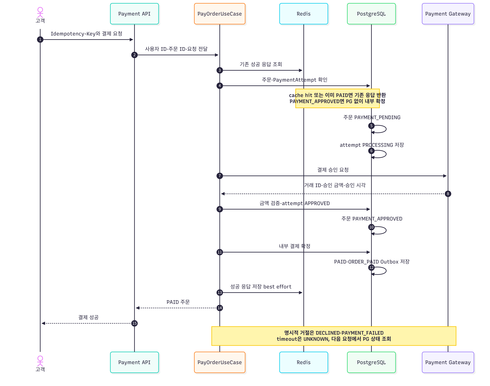
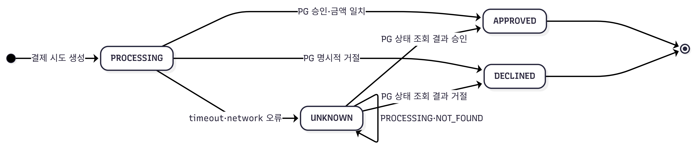

# 결제 정책

## 결제 처리 흐름

신규 결제의 정상 승인 흐름을 중심으로 표시하고 재요청·실패 처리는 Note로 정리합니다.

PG 승인과 `PAID` 내부 확정은 분리돼 있습니다. 승인 뒤 내부 확정이 실패해도 다음
요청에서 `PAYMENT_APPROVED`를 확인해 PG를 다시 호출하지 않고 확정만 재시도합니다.

## 요청 조건

- 주문 소유자만 결제할 수 있습니다.
- 주문은 `CREATED` 또는 `PAYMENT_FAILED`여야 합니다.
- `expiresAt`이 지나면 결제를 시작할 수 없습니다.
- HTTP `Idempotency-Key` 헤더가 필수이며 DB 제약상 길이는 8~100자입니다.
- 요청 fingerprint에는 결제 요청 내용이 반영됩니다.

현재 `PaymentRequestDto`의 입력은 테스트용 `forceFail`뿐이며 결제 수단·카드 정보는
다루지 않습니다.

## 결제 시도

`UNKNOWN`은 실패 확정 상태가 아닙니다. 같은 `Idempotency-Key` 요청에서 PG 상태를
조회한 뒤 `APPROVED`, `DECLINED` 또는 계속 `UNKNOWN`으로 결정합니다.

| 상태 | 의미 |
| --- | --- |
| `PROCESSING` | 요청을 기록하고 PG 결과를 기다리는 상태 |
| `APPROVED` | PG 승인과 거래 ID를 저장한 상태 |
| `DECLINED` | 명시적으로 거절된 상태 |
| `UNKNOWN` | timeout·network 오류 등 결과가 불명확한 상태 |

주문별 `Idempotency-Key`는 유일합니다. 같은 key와 같은 fingerprint는 저장된 시도를
재사용하고, 다른 fingerprint는 거부합니다. Redis lock은 동시 중복 요청을 줄이는
보조 수단이고 DB unique 제약이 최종 방어선입니다.

## 승인과 내부 확정

PG 승인 응답 금액은 주문 금액과 같아야 합니다. 서버는 거래 ID와 승인 시각을
`payment_attempt`에 저장하고 주문을 `PAYMENT_APPROVED`로 변경한 뒤, 별도 내부
확정 단계에서 `PAID`로 변경합니다. 이 단계에서 장바구니 정리, 판매 수량 반영,
상태 이력과 `ORDER_PAID` Outbox 기록이 이루어집니다.

이미 `PAYMENT_APPROVED`인 주문은 PG를 다시 호출하지 않고 내부 확정을 재시도합니다.
이미 `PAID`인 주문도 성공 결과를 반환합니다.

## 실패와 불명확 결과

- 명시적 거절: 결제 시도 `DECLINED`, 주문 `PAYMENT_FAILED`
- timeout·network 오류: 결제 시도 `UNKNOWN`; 자동으로 실패 확정하지 않음
- `PROCESSING` 또는 `UNKNOWN`은 reconciliation 조회 대상
- `PAYMENT_FAILED` 주문은 예약 만료 전 새 key로 재결제 가능
- 예약 시간이 지나면 만료 스케줄러가 재고를 복구

외부 PG의 실제 승인 조회와 webhook 처리는 adapter 구현에 따라 보완해야 합니다.

## 환불

현재 부분 환불은 지원하지 않고 전액 환불만 지원합니다.

- `PAID` 주문: `CANCEL_REQUESTED`로 바꾼 뒤 승인된 PG 거래를 전액 환불
- 성공: `REFUNDED`, `refundedAt` 저장, 상품 재고 복구, `ORDER_CANCELED` 기록
- 실패: `CANCEL_FAILED`와 실패 사유 저장
- 재시도 API: `CANCEL_FAILED`를 다시 `CANCEL_REQUESTED`로 전환해 같은 흐름 실행
- 이미 `REFUNDED`이면 같은 결과 반환

SMTP와 마찬가지로 외부 환불과 로컬 DB 갱신은 한 transaction이 아닙니다. 실제 PG
연동 전 환불 key, 승인 조회와 webhook 기반 reconciliation을 정의해야 합니다.
