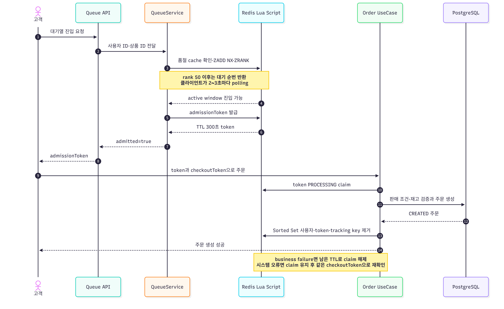

# 대기열 정책

## 대기열과 주문 처리 흐름

대기열 진입부터 입장 토큰 소비까지의 정상 흐름을 표시하고 대기·실패 정책은 Note로
정리합니다.

입장 토큰은 대기열 통과만 증명합니다. 재고와 판매 가능 여부는 PostgreSQL 주문
transaction이 최종 판단합니다.

대기열은 `LIMITED` 상품 주문 전에만 사용합니다. 일반 상품은 바로 주문 검증과 재고
차감으로 이동합니다.

## 진입과 순번

- 상품별 Redis Sorted Set에 사용자 ID를 넣습니다.
- score는 최초 진입 시각(ms)이고 `ZADD NX`로 재진입해도 기존 순서를 유지합니다.
- rank가 앞에서 50명 안이면 즉시 입장 토큰을 발급합니다.
- 그 뒤 사용자는 `rank - 50 + 1`을 대기 순번으로 받습니다.
- 예상 대기 시간은 `position × 2초`인 단순 표시값입니다.
- 품절 캐시가 있으면 대기열 진입을 거부합니다.

클라이언트는 `GET /api/user/queue/status?productId=...`를 2~3초 간격으로 호출합니다.
상태 조회도 같은 원자적 Redis script를 사용하므로 중복 등록 없이 기존 순번 또는
기존 토큰을 반환합니다.

## 입장 토큰

- 토큰 유효 시간: 300초
- 사용자·상품 조합에 기존 유효 토큰이 있으면 같은 토큰 반환
- 주문 시작 시 token 값을 `PROCESSING:<user>:<product>:<checkoutToken>`으로 claim
- 주문 성공 시 token과 사용자 추적 key 삭제
- 주문 실패 시 남은 TTL을 유지한 채 claim 해제

토큰은 사용자와 상품에 묶여 있으므로 다른 사용자나 상품에 재사용할 수 없습니다.
`checkoutToken`을 claim 값에 넣어 동시에 들어온 주문 요청도 구분합니다.

## 주문과의 경계

입장 토큰은 주문 자격만 증명합니다. 실제 판매 가능 상태, 기간, 구매 제한과 재고는
주문 transaction에서 다시 확인합니다. 입장 후 품절될 수 있으며, 이 경우 주문은
생성되지 않습니다.

## 현재 제한

- active window 50은 고정 상수이며 상품별 설정이 아닙니다.
- 예상 대기 시간은 처리량 측정값이 아닙니다.
- 대기열 Sorted Set 자체에는 만료가 없고, 토큰 TTL 만료 시 사용자를 자동 제거하는
  scheduler도 현재 없습니다. 주문 성공 시에는 제거되지만 이탈한 상위 사용자가 계속
  rank를 차지할 수 있으므로 운영 전 stale entry 정리 정책이 필요합니다.
- Redis 장애 시 대기열·토큰을 사용할 수 없습니다. 주문 rate limit만 fail-open이고
  한정 상품 입장 검증은 우회되지 않습니다.
- 판매 종료를 감지해 대기자 전체를 종료시키는 별도 절차는 없습니다.
