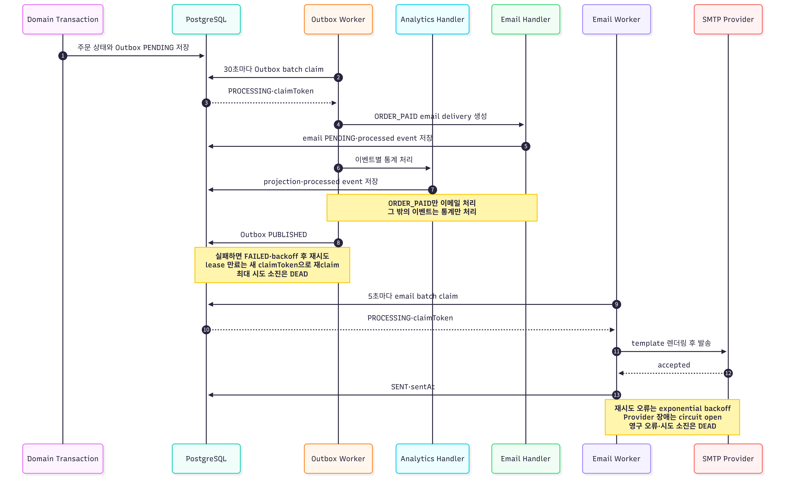

# Worker 타임라인

Worker는 `internal-worker` 프로필에서만 실행됩니다. Outbox 저장부터 통계와 이메일
발송이 완료되기까지의 정상 흐름을 표시하고 복구 정책은 Note로 정리합니다.

## Outbox 처리 기준

- claim token과 processing lease로 여러 인스턴스의 소유권을 구분합니다.
- `ORDER_PAID`는 이메일 delivery를 만든 뒤 통계 handler를 실행합니다.
- 두 handler는 각각 새 transaction이며 첫 handler가 실패해도 두 번째까지 시도합니다.
- 성공한 handler는 `internal_processed_event`에 기록돼 Outbox 재시도 때 건너뜁니다.
- `ORDER_CREATED`, `PAYMENT_FAILED`, `ORDER_EXPIRED`, `ORDER_CANCELED`는 통계만 처리합니다.

## 이메일 처리 기준

- `MAIL_ENABLED=true`일 때만 Email Delivery Worker가 실행됩니다.
- 기본값은 최대 5회, batch 100개, processing lease 600초입니다.
- 재시도 가능한 오류는 exponential backoff 후 `FAILED`, 영구 오류는 `DEAD`입니다.
- Provider 장애는 circuit를 열고 이미 claim한 나머지 batch도 함께 해제합니다.
- SMTP 성공과 DB의 `SENT` 저장은 원자적이지 않아 프로세스 중단 시 중복 발송될 수 있습니다.

Outbox는 성공 상태로 `PUBLISHED`, 이메일 delivery는 `SENT`를 사용합니다. 관리자
재시도 API는 이메일의 `DEAD` row만 `PENDING`으로 되돌립니다.
